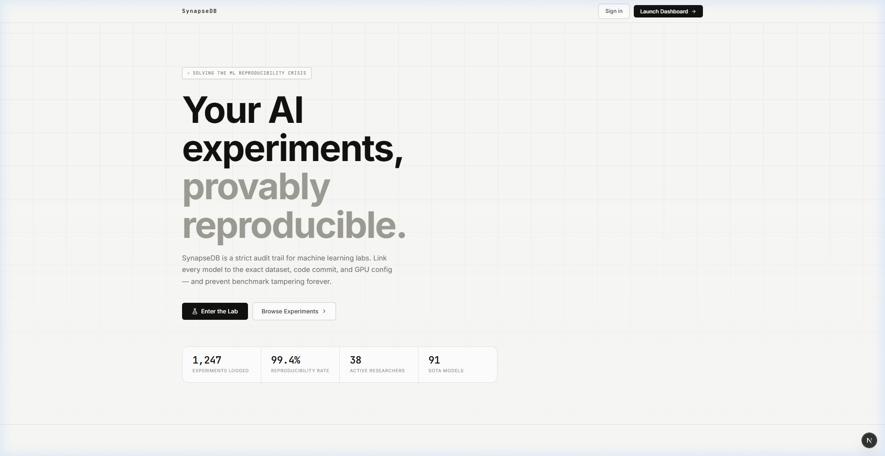
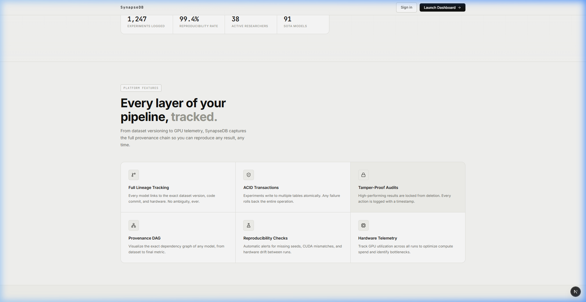
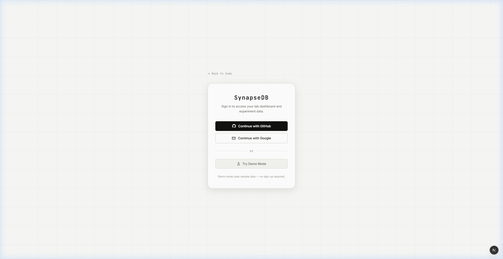
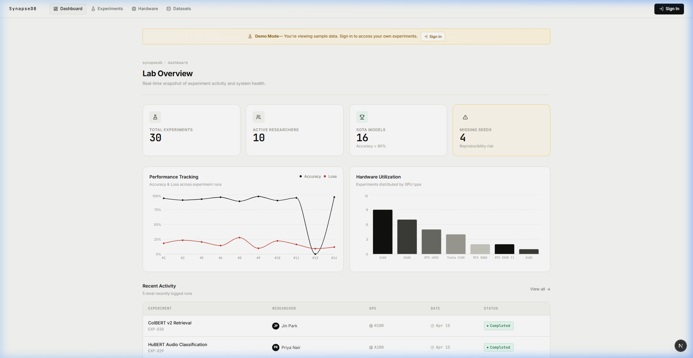
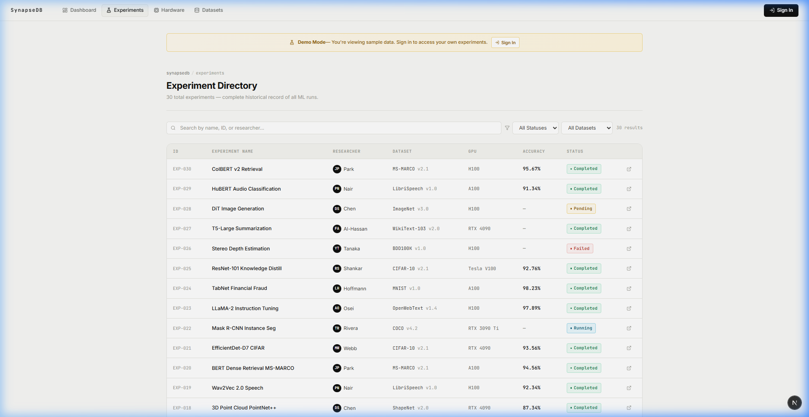
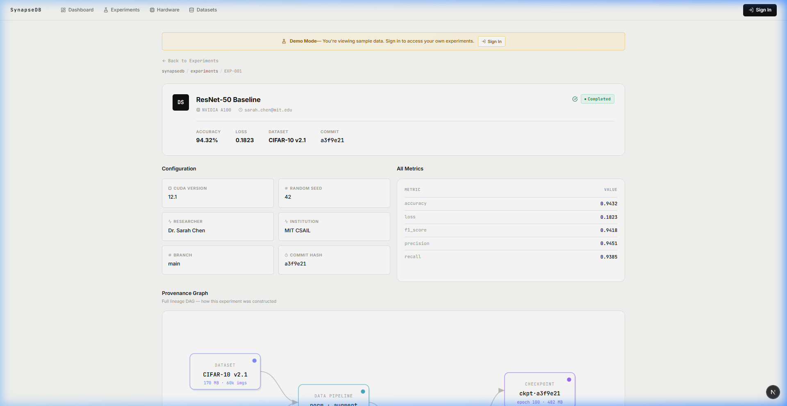
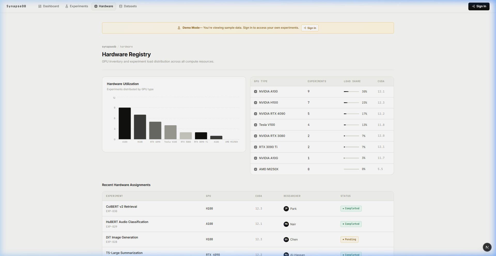
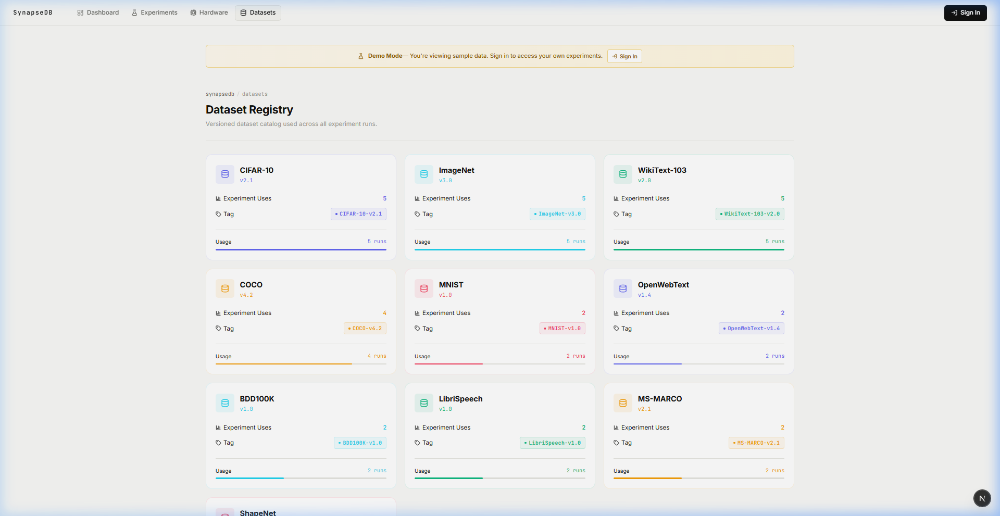

<div align="center">

# SynapseDB

**AI Provenance & Reproducibility Tracker**

A full-stack platform for ML research labs to build trusted, verifiable experiment pipelines with ACID-compliant audit trails.

[](https://nextjs.org/)
[](https://typescriptlang.org/)
[](https://authjs.dev/)
[](https://mysql.com/)
[](LICENSE)

</div>

---

## Screenshots

<details>
<summary><strong>🏠 Landing Page</strong></summary>




</details>

<details>
<summary><strong>🔐 Authentication</strong></summary>



</details>

<details>
<summary><strong>📊 Dashboard</strong></summary>



</details>

<details>
<summary><strong>🧪 Experiments</strong></summary>




</details>

<details>
<summary><strong>🖥️ Hardware & Datasets</strong></summary>




</details>

---

## Features

- **Full Lineage Tracking** — Every model links to the exact dataset version, code commit, and hardware config
- **ACID Transactions** — Experiments write to `experiments`, `results`, and `auditlog` tables atomically
- **Tamper-Proof Audits** — High-performing results are locked from deletion; every action is timestamped
- **Provenance DAG** — Visual dependency graph from dataset to final metric for any experiment
- **Reproducibility Checks** — Automatic alerts for missing seeds, CUDA mismatches, and hardware drift
- **Hardware Telemetry** — GPU utilization tracking across all runs
- **OAuth Authentication** — GitHub & Google sign-in via NextAuth.js v5
- **Demo Mode** — Full read-only access with sample data for unauthenticated users

---

## Tech Stack

| Layer | Technology |
|-------|-----------|
| **Framework** | Next.js 16 (App Router, Turbopack) |
| **Language** | TypeScript 5 |
| **Auth** | NextAuth.js v5 (GitHub, Google, Credentials) |
| **Database** | MySQL 8 via `mysql2` connection pool |
| **Styling** | Vanilla CSS with custom properties |
| **Charts** | Recharts |
| **Animations** | Framer Motion |
| **Icons** | Lucide React |

---

## Getting Started

### Prerequisites

- **Node.js** ≥ 18
- **MySQL** 8.x (optional — app works in demo mode without a database)

### 1. Clone & Install

```bash
git clone https://github.com/YOUR_USERNAME/synapsedb.git
cd synapsedb
npm install
```

### 2. Environment Variables

Copy the example environment file and fill in your values:

```bash
cp .env.example .env.local
```

```env
# Database (optional — demo mode works without this)
DB_HOST=127.0.0.1
DB_PORT=3306
DB_USER=root
DB_PASSWORD=your_password
DB_NAME=ai_provenance_db

# NextAuth — generate with: node -e "console.log(require('crypto').randomBytes(32).toString('base64'))"
AUTH_SECRET=your_secret_here

# OAuth Providers (optional — demo mode works without these)
GITHUB_ID=your_github_client_id
GITHUB_SECRET=your_github_client_secret
GOOGLE_ID=your_google_client_id
GOOGLE_SECRET=your_google_client_secret
```

### 3. Run Development Server

```bash
npm run dev
```

Open [http://localhost:3000](http://localhost:3000) to view the app.

### 4. (Optional) Set Up MySQL

If you want to use a real database instead of demo mode:

```sql
CREATE DATABASE ai_provenance_db;
```

Then create the required tables (`experiments`, `researchers`, `datasets`, `hardwareconfigs`, `codecommits`, `results`, `auditlog`) matching the schema used by the API routes.

---

## Project Structure

```
synapsedb/
├── app/
│   ├── api/                    # API routes (auth-aware, demo fallback)
│   │   ├── auth/[...nextauth]/ # NextAuth handler
│   │   ├── dashboard/          # Dashboard KPIs & charts
│   │   ├── experiments/        # Experiment CRUD
│   │   ├── datasets/           # Dataset usage stats
│   │   ├── hardware/           # GPU telemetry
│   │   ├── auditlog/           # Audit trail
│   │   ├── researchers/        # Researcher directory
│   │   ├── codecommits/        # Code commit refs
│   │   └── log/                # ACID transaction endpoint
│   ├── auth/signin/            # Sign-in page
│   ├── dashboard/              # Main dashboard
│   ├── experiments/            # Experiments list
│   ├── experiment/[id]/        # Experiment detail + provenance
│   ├── hardware/               # Hardware telemetry
│   ├── datasets/               # Dataset usage
│   ├── log/                    # Log new experiment form
│   ├── components/             # Shared UI components
│   │   ├── Navbar.tsx
│   │   ├── Preloader.tsx
│   │   ├── DemoBanner.tsx
│   │   ├── AuthProvider.tsx
│   │   ├── ProvenanceGraph.tsx
│   │   └── charts/
│   ├── lib/
│   │   ├── db.ts               # MySQL connection pool
│   │   └── demoData.ts         # Static demo data (30 experiments)
│   ├── layout.tsx              # Root layout with AuthProvider
│   ├── page.tsx                # Landing page
│   ├── globals.css             # Design system
│   └── homepage.css            # Landing page styles
├── auth.ts                     # NextAuth v5 config
├── .env.example                # Environment template
├── package.json
└── tsconfig.json
```

---

## Authentication Flow

```
┌──────────────┐     ┌─────────────┐     ┌──────────────┐
│  Landing     │────▶│  Sign In    │────▶│  Dashboard   │
│  Page        │     │  (OAuth)    │     │  (Live Data) │
└──────┬───────┘     └─────────────┘     └──────────────┘
       │
       │ Not signed in?
       ▼
┌──────────────┐
│  Dashboard   │
│  (Demo Mode) │
│  + Banner    │
└──────────────┘
```

- **Authenticated users** → real MySQL queries, full CRUD access
- **Unauthenticated users** → static demo data (30 experiments), read-only
- **Log Run page** → requires authentication (write operations need audit trail)

---

## Demo Mode

When no user is signed in, clicking "Launch Dashboard" shows a toast notification:

> ⚠️ **Not signed in** — Launching demo mode with sample data…

The app then loads with:
- 30 pre-built experiments across 10 researchers
- Full KPI metrics, charts, and tables
- A persistent yellow "Demo Mode" banner with a sign-in link
- All navigation works identically to the live version

---

## API Routes

All API routes are **auth-aware** with automatic demo fallback:

| Route | Method | Auth Required | Description |
|-------|--------|:---:|-------------|
| `/api/dashboard` | GET | ❌ | Dashboard KPIs, charts, activity |
| `/api/experiments` | GET | ❌ | Full experiment list |
| `/api/experiments/[id]` | GET | ❌ | Single experiment + metrics |
| `/api/datasets` | GET | ❌ | Dataset usage statistics |
| `/api/hardware` | GET | ❌ | GPU telemetry & assignments |
| `/api/auditlog` | GET | ❌ | Audit trail entries |
| `/api/researchers` | GET | ❌ | Researcher directory |
| `/api/codecommits` | GET | ❌ | Code commit references |
| `/api/log` | POST | ✅ | Log new experiment (ACID) |

> Routes marked ❌ return **demo data** when unauthenticated, or **real DB data** when signed in.

---

## Database Schema

The platform uses 7 core tables with foreign key constraints:

```
researchers ──┐
              ├──▶ experiments ──▶ results
datasets ─────┤                    │
codecommits ──┤                    ▼
hardwareconfigs┘               auditlog
```

Key DBMS concepts demonstrated:
- **ACID Transactions** — atomic writes across 3 tables
- **Foreign Key Constraints** — referential integrity
- **Aggregate Queries** — KPI computation with `COUNT`, `AVG`, `GROUP BY`
- **Audit Logging** — immutable append-only log table

---

## License

MIT © 2026

---

<div align="center">
  <sub>Built with Next.js, TypeScript, and MySQL</sub>
</div>
